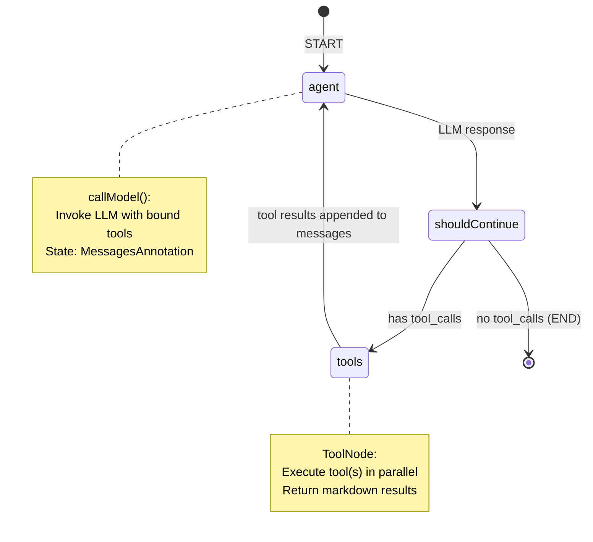
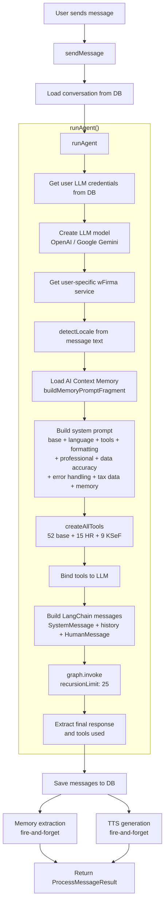
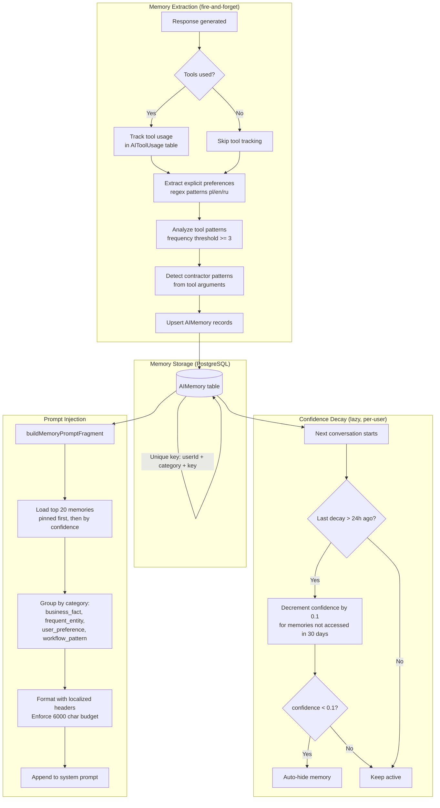

# AI Agent Architecture

This document describes the LangGraph-based single-agent architecture powering the Accounting AI Agent.

## Overview

The system uses a **single LangGraph agent** with 50+ tools (up to 76 when all optional services are available). There is no multi-agent routing -- a single `StateGraph` with `agent` and `tools` nodes handles all user requests. The LLM decides which tools to call based on the user's message and the conversation history.

**Key characteristics:**

- **Single agent, many tools** -- one LangGraph `StateGraph` with `MessagesAnnotation` state
- **Recursion limit: 25** -- prevents infinite tool-calling loops
- **LLM providers:** OpenAI (gpt-4, gpt-3.5-turbo, gpt-5, o1, o3) or Google Gemini
- **User-owned API keys** -- each user provides their own LLM API key (stored encrypted in DB)
- **AI Context Memory** -- persistent cross-session memory injected into the system prompt
- **Localized responses** -- all tool outputs return markdown in pl/en/ru
- **TTS integration** -- fire-and-forget audio generation after each response
- **LangSmith tracing** -- full observability when `LANGCHAIN_TRACING_V2=true`

### Source Files

| File | Purpose |
|------|---------|
| `packages/api/src/services/ai-chat/ai-chat.service.ts` | Main service: conversation CRUD, `sendMessage`, `runAgent` |
| `packages/api/src/services/ai-chat/tools/index.ts` | `createAllTools()` factory -- registers all 76 tools |
| `packages/api/src/services/ai-chat/constants.ts` | `getSystemPrompt()` builder |
| `packages/api/src/services/ai-chat/prompt-fragments.ts` | Shared prompt fragments (language, tools, formatting, tax data) |
| `packages/api/src/services/ai-chat/utils.ts` | `detectLocale()`, title generation |
| `packages/api/src/services/ai-chat/tts-integration.ts` | TTS fire-and-forget after response |
| `packages/api/src/services/ai-memory/ai-memory.service.ts` | Memory storage, retrieval, decay, prompt injection |
| `packages/api/src/services/ai-memory/memory-extraction.service.ts` | Fire-and-forget memory extraction after each response |

---

## LangGraph State Machine

The agent uses a standard LangGraph ReAct loop: the LLM generates a response, and if it contains tool calls, the tools are executed and results fed back. This repeats until the LLM produces a final text response or the recursion limit is reached.



**Implementation detail** (from `runAgent` in `ai-chat.service.ts`):

```typescript
const workflow = new StateGraph(MessagesAnnotation)
  .addNode('agent', callModel)
  .addNode('tools', toolNode)
  .addEdge(START, 'agent')
  .addConditionalEdges('agent', shouldContinue, ['tools', END])
  .addEdge('tools', 'agent');

const graph = workflow.compile();

const result = await graph.invoke(
  { messages: langchainMessages },
  { recursionLimit: 25, metadata: { conversationId, userId } }
);
```

---

## Message Processing Pipeline

When `sendMessage()` is called, the following steps execute in sequence:



---

## AI Context Memory Lifecycle

The memory system learns from conversations and injects relevant context into future system prompts. Memory extraction runs asynchronously after each response so it does not add latency.



### Memory Categories

| Category | Source | Example |
|----------|--------|---------|
| `business_fact` | `explicit` | "My company uses flat tax 19%" |
| `frequent_entity` | `tool_usage` | Contractor "ABC Corp" (NIP: 1234567890) -- queried 5 times |
| `user_preference` | `explicit` | "I always want invoices in PLN" |
| `workflow_pattern` | `tool_usage` | Frequently uses `get_invoices` (12 times) -- invoices operations |

### Memory Sources

| Source | Confidence | Trigger |
|--------|-----------|---------|
| `explicit` | 0.8 | User says "I always...", "my company...", etc. (regex match) |
| `implicit` | 0.5 | Inferred from behavior |
| `tool_usage` | 0.3 + 0.05*count | Tool called >= 3 times |

### Memory Constants

| Constant | Value | Purpose |
|----------|-------|---------|
| `MAX_PROMPT_MEMORIES` | 20 | Maximum memories injected into prompt |
| `MAX_PROMPT_CHARS` | 6000 | Token budget (~1500 tokens) |
| `DECAY_AMOUNT` | 0.1 | Confidence decrement per cycle |
| `DECAY_AFTER_DAYS` | 30 | Days before decay triggers |
| `MIN_CONFIDENCE` | 0.1 | Below this, memory is auto-hidden |
| `DECAY_INTERVAL_MS` | 24 hours | Minimum interval between decay runs |
| `FREQUENCY_THRESHOLD` | 3 | Minimum tool calls to generate pattern memory |

---

## Tool Catalog

All tools are created by `createAllTools()` in `packages/api/src/services/ai-chat/tools/index.ts`. Tools are organized by domain.

### Company (3 tools)

| Tool | Description | File |
|------|-------------|------|
| `get_company_info` | Get company details | `company.tool.ts` |
| `get_company_accounts` | Get company bank accounts | `company.tool.ts` |
| `get_company_addresses` | Get company addresses | `company.tool.ts` |

### Financial (1 tool)

| Tool | Description | File |
|------|-------------|------|
| `get_financial_summary` | Financial data for a year | `financial.tool.ts` |

### Contractors (4 tools)

| Tool | Description | File |
|------|-------------|------|
| `get_contractors` | List/search contractors | `contractor.tools.ts` |
| `create_contractor` | Create new contractor | `contractor.tools.ts` |
| `update_contractor` | Update contractor | `contractor.tools.ts` |
| `delete_contractor` | Delete contractor | `contractor.tools.ts` |

### Invoices (10 tools)

| Tool | Description | File |
|------|-------------|------|
| `get_invoices` | List invoices with filters | `invoice.tools.ts` |
| `get_invoice_details` | Get single invoice details | `invoice.tools.ts` |
| `create_invoice` | Create new invoice | `invoice.tools.ts` |
| `update_invoice` | Update invoice | `invoice.tools.ts` |
| `delete_invoice` | Delete invoice | `invoice.tools.ts` |
| `send_invoice` | Send invoice by email | `invoice.tools.ts` |
| `download_invoice` | Download invoice PDF | `invoice.tools.ts` |
| `add_invoice_note` | Add note to invoice | `invoice.tools.ts` |
| `get_invoice_notes` | Get invoice notes | `invoice.tools.ts` |
| `delete_invoice_note` | Delete invoice note | `invoice.tools.ts` |

### Users (3 tools)

| Tool | Description | File |
|------|-------------|------|
| `get_users` | List wFirma users | `user.tools.ts` |
| `get_user_companies` | List user's companies | `user.tools.ts` |
| `get_user_company_by_id` | Get specific company details | `user.tools.ts` |

### Payments (5 tools)

| Tool | Description | File |
|------|-------------|------|
| `get_payments` | List payments | `payment.tools.ts` |
| `get_payment_details` | Get payment details | `payment.tools.ts` |
| `add_payment` | Add payment | `payment.tools.ts` |
| `update_payment` | Update payment | `payment.tools.ts` |
| `delete_payment` | Delete payment | `payment.tools.ts` |

### Expenses (2 tools)

| Tool | Description | File |
|------|-------------|------|
| `get_expenses` | List expenses | `expense.tools.ts` |
| `get_expense_details` | Get expense details | `expense.tools.ts` |

### Vehicles (5 tools)

| Tool | Description | File |
|------|-------------|------|
| `get_vehicles` | List vehicles | `vehicle.tools.ts` |
| `get_vehicle_details` | Get vehicle details | `vehicle.tools.ts` |
| `add_vehicle` | Add vehicle | `vehicle.tools.ts` |
| `update_vehicle` | Update vehicle | `vehicle.tools.ts` |
| `delete_vehicle` | Delete vehicle | `vehicle.tools.ts` |

### Terms (5 tools)

| Tool | Description | File |
|------|-------------|------|
| `get_terms` | List payment terms | `term.tools.ts` |
| `get_term_details` | Get term details | `term.tools.ts` |
| `add_term` | Add payment term | `term.tools.ts` |
| `update_term` | Update term | `term.tools.ts` |
| `delete_term` | Delete term | `term.tools.ts` |

### Term Groups (5 tools)

| Tool | Description | File |
|------|-------------|------|
| `get_term_groups` | List term groups | `term.tools.ts` |
| `get_term_group_details` | Get term group details | `term.tools.ts` |
| `add_term_group` | Add term group | `term.tools.ts` |
| `update_term_group` | Update term group | `term.tools.ts` |
| `delete_term_group` | Delete term group | `term.tools.ts` |

### Declarations (2 tools)

| Tool | Description | File |
|------|-------------|------|
| `get_jpk_vat` | Get JPK_VAT declaration data | `declaration.tools.ts` |
| `get_pit` | Get PIT declaration data | `declaration.tools.ts` |

### Documents (4 tools)

| Tool | Description | File |
|------|-------------|------|
| `get_documents` | List documents | `document.tools.ts` |
| `get_document_details` | Get document details | `document.tools.ts` |
| `download_document` | Download document file | `document.tools.ts` |
| `delete_document` | Delete document | `document.tools.ts` |

### Ledger (4 tools)

| Tool | Description | File |
|------|-------------|------|
| `get_fiscal_years` | List fiscal years | `ledger.tools.ts` |
| `get_fiscal_year_details` | Get fiscal year details | `ledger.tools.ts` |
| `get_accounting_schemas` | List accounting schemas | `ledger.tools.ts` |
| `get_accounting_schema_details` | Get accounting schema details | `ledger.tools.ts` |

### HR (15 tools, conditional)

Loaded when `hrService` is available.

| Tool | Description | File |
|------|-------------|------|
| `get_employees` | List employees | `hr.tools.ts` |
| `get_employee_details` | Get employee details | `hr.tools.ts` |
| `add_employee` | Add employee | `hr.tools.ts` |
| `update_employee` | Update employee | `hr.tools.ts` |
| `delete_employee` | Delete employee | `hr.tools.ts` |
| `get_hr_contracts` | List employment contracts | `hr.tools.ts` |
| `add_hr_contract` | Add employment contract | `hr.tools.ts` |
| `terminate_hr_contract` | Terminate contract | `hr.tools.ts` |
| `calculate_payroll` | Preview payroll calculation (does NOT save) | `hr.tools.ts` |
| `save_payroll_record` | Calculate and save payroll record | `hr.tools.ts` |
| `delete_payroll_record` | Delete payroll record | `hr.tools.ts` |
| `get_payroll_records` | List payroll records | `hr.tools.ts` |
| `add_absence` | Record absence | `hr.tools.ts` |
| `get_absences` | List absences | `hr.tools.ts` |
| `get_hr_summary` | HR overview summary | `hr.tools.ts` |

### KSeF (9 tools, conditional)

Loaded when `ksefService` is available.

| Tool | Description | File |
|------|-------------|------|
| `send_to_ksef` | Submit existing wFirma invoice to KSeF | `ksef.tools.ts` |
| `create_and_send_to_ksef` | Create FA(3) invoice from chat and submit to KSeF | `ksef.tools.ts` |
| `check_ksef_status` | Get invoice status by reference number | `ksef.tools.ts` |
| `download_ksef_upo` | Download UPO (official confirmation) | `ksef.tools.ts` |
| `query_ksef_invoices` | List KSeF invoices with filters | `ksef.tools.ts` |
| `get_ksef_statistics` | Statistics: totals by status, monthly breakdown | `ksef.tools.ts` |
| `bulk_send_to_ksef` | Batch-send multiple invoices | `ksef.tools.ts` |
| `get_incoming_ksef_invoices` | Fetch received invoices from KSeF API | `ksef.tools.ts` |
| `match_incoming_ksef_invoice` | Match incoming invoice to wFirma records | `ksef.tools.ts` |

### Tool Count Summary

| Domain | Count | Conditional |
|--------|-------|-------------|
| Company | 3 | No |
| Financial | 1 | No |
| Contractors | 4 | No |
| Invoices | 10 | No |
| Users | 3 | No |
| Payments | 5 | No |
| Expenses | 2 | No |
| Vehicles | 5 | No |
| Terms | 5 | No |
| Term Groups | 5 | No |
| Declarations | 2 | No |
| Documents | 4 | No |
| Ledger | 4 | No |
| HR | 15 | Yes (hrService) |
| KSeF | 9 | Yes (ksefService) |
| **Total** | **77** | |

---

## System Prompt Structure

The system prompt is built dynamically by `getSystemPrompt()` in `constants.ts`, which delegates to `buildSystemPrompt()` in `prompt-fragments.ts`. Fragments are layered in this order:

```
1. Base prompt (accounting expertise, tax systems, business operations, HR, compliance)
2. Language rules (auto-detected locale: pl/en/ru)
3. Tool usage guidelines (when to use tools vs. general knowledge, HR/payroll rules)
4. Response formatting rules (markdown tables, number formatting, headers)
5. Professional standards (tone, legal citations, disclaimers)
6. Data accuracy guidelines (verify calculations, current rates, cross-reference)
7. Error handling (transparent failures, no fabrication, helpful next steps)
8. [Optional] Security guidelines (sensitive data handling)
9. [Optional] Polish tax data 2026 (VAT, PIT, CIT, ZUS rates and thresholds)
10. [Optional] AI Context Memory (personalized facts from previous conversations)
```

### Language Detection

Automatic detection based on character patterns in the user's message:

| Pattern | Detected Locale |
|---------|----------------|
| Cyrillic characters (`U+0400`-`U+04FF`) | `ru` (Russian) |
| Polish diacritics (a,c,e,l,n,o,s,z,z) | `pl` (Polish) |
| Default (Latin without Polish chars) | `en` (English) |

---

## Localization

### System Prompt Localization

The language rules fragment tells the LLM which language was detected and instructs it to respond in that language throughout the conversation.

### Tool Response Localization

All tools receive the detected `locale` parameter and return markdown formatted in the user's language.

**English:**
```markdown
## Invoice FV/2026/001
- **Client:** ABC Corp
- **Amount:** 5,000.00 PLN
- **Due Date:** 2026-02-15
```

**Polish:**
```markdown
## Faktura FV/2026/001
- **Klient:** ABC Corp
- **Kwota:** 5 000,00 PLN
- **Termin platnosci:** 15.02.2026
```

**Russian:**
```markdown
## Schet FV/2026/001
- **Klient:** ABC Corp
- **Summa:** 5 000,00 PLN
- **Srok oplaty:** 15.02.2026
```

### Memory Context Localization

Memory prompt fragments use localized section headers:

| Category | Polish | English | Russian |
|----------|--------|---------|---------|
| `business_fact` | Fakty o firmie | Business Facts | Fakty o biznese |
| `frequent_entity` | Czeste kontakty | Frequent Contacts | Chastye kontakty |
| `user_preference` | Twoje preferencje | Your Preferences | Vashi predpochteniya |
| `workflow_pattern` | Wzorce pracy | Workflow Patterns | Rabochie shablony |

---

## KSeF Tools

KSeF tools are available in the AI agent when the user has KSeF configured. They are registered alongside wFirma tools in `createAllTools()`.

### Available KSeF Tools (9)

| Tool | Description | Key Parameters |
|------|-------------|----------------|
| `create_and_send_to_ksef` | Create FA(3) invoice from chat and submit to KSeF | sellerName, buyerName, items, totals (NIP/address auto-filled from DB) |
| `send_invoice_to_ksef` | Submit existing wFirma invoice to KSeF | invoiceId |
| `check_ksef_status` | Get invoice status by reference number | referenceNumber |
| `download_ksef_upo` | Download UPO (official confirmation) | referenceNumber |
| `query_ksef_invoices` | List invoices with filters | dateFrom?, dateTo?, status?, direction? |
| `get_incoming_ksef_invoices` | Fetch received invoices from KSeF API | dateFrom?, dateTo?, status? |
| `match_incoming_ksef_invoice` | Match incoming invoice to wFirma records | referenceNumber |
| `get_ksef_statistics` | Statistics: totals by status, monthly breakdown | -- |
| `bulk_send_to_ksef` | Batch-send multiple invoices | invoiceIds[], continueOnError? |

### Contractor Auto-fill in `create_and_send_to_ksef`

When the user provides only a company name (without NIP or address), the tool automatically:

1. Calls `KSeFContractorService.listContractors(userId, partyName)`
2. Finds a match by name (substring match in both directions)
3. Fills in missing NIP, street, city, zip from the matched record
4. Source priority: `company` > `wfirma` > `local`
5. If NIP is still unresolved, returns an error asking the user to provide it explicitly

**Example flow:**
```
User: "Wyslij fakture KSeF: Sprzedawca: Micode Sp. z o. o. ..."
        |
        v
create_and_send_to_ksef({ sellerName: "Micode Sp. z o. o.", sellerNip: undefined, ... })
        |
        v
KSeFContractorService.listContractors(userId, "Micode Sp. z o. o.")
  -> finds { source: 'company', nip: '1234567890', street: 'ul. Przykladowa 1', ... }
        |
        v
FA3InvoiceData populated with resolved NIP + address -> XML generated -> KSeF submitted
```

### KSeF Tool Response Format

Tools return localized markdown responses via `ksef.formatter.ts`:

```markdown
## Invoice Sent to KSeF

- **Reference:** 1234567890-20260219-ABCD1234
- **Invoice Number:** FV/2026/02/001
- **Status:** accepted
- **Sent:** 2026-02-19 10:00:05
```

---

## Example Flows

### Contractor Query

```
User: "Show my contractors"
        |
        v
sendMessage() -> runAgent()
        |
        v
detectLocale("Show my contractors") -> 'en'
        |
        v
buildMemoryPromptFragment(userId, 'en') -> memory context (or undefined)
        |
        v
getSystemPrompt('en', memoryContext) -> full system prompt
        |
        v
createAllTools(...) -> 76 tools bound to LLM
        |
        v
graph.invoke({ messages: [SystemMessage, HumanMessage] })
        |
        v
LLM -> tool_call: get_contractors({})
        |
        v
ToolNode executes get_contractors -> returns markdown table
        |
        v
LLM -> final response: "Here are your contractors: [table]"
        |
        v
Memory extraction (fire-and-forget): track get_contractors usage
        |
        v
Result: { response: "## Contractors (3)...", toolsUsed: ["get_contractors"] }
```

### Invoice Creation (Multi-Tool)

```
User: "Create invoice for ABC Corp for 5000 PLN"
        |
        v
graph.invoke(...)
        |
        v
LLM -> tool_call: get_contractors({ search: "ABC Corp" })
        |
        v
ToolNode -> returns contractor data with ID
        |
        v
LLM -> tool_call: create_invoice({ contractor: "ABC Corp", items: [...] })
        |
        v
ToolNode -> returns created invoice details
        |
        v
LLM -> "Invoice FV/2026/001 created successfully for ABC Corp"
        |
        v
Memory extraction: track get_contractors + create_invoice usage
        |
        v
Result: { toolsUsed: ["get_contractors", "create_invoice"] }
```

### Payroll Workflow (Preview then Save)

```
User: "Calculate payroll for Jan Kowalski, 8000 PLN gross"
        |
        v
LLM -> tool_call: calculate_payroll({ employeeName: "Jan Kowalski", grossAmount: 8000 })
        |
        v
ToolNode -> returns payroll breakdown (preview only, NOT saved)
        |
        v
LLM -> "Here is the payroll preview: [breakdown]. Would you like to save this?"
        |
        v
User: "Yes, save it"
        |
        v
LLM -> tool_call: save_payroll_record({ employeeName: "Jan Kowalski", grossAmount: 8000, month: "2026-02" })
        |
        v
ToolNode -> calculates AND saves to database, returns confirmation
        |
        v
LLM -> "Payroll record saved for Jan Kowalski, February 2026"
```

---

## LLM Configuration

| Property | Value |
|----------|-------|
| Providers | OpenAI, Google Gemini |
| API keys | User-provided, stored encrypted in DB |
| Default provider | `openai` (fallback only) |
| Temperature | 0.7 (standard models), 1.0 (gpt-5/o1/o3 models) |
| Max tokens | Configured per provider in `DEFAULT_LLM_CONFIG` |
| Recursion limit | 25 |

### Newer Model Handling

Models starting with `gpt-5`, `o1`, or `o3` are treated specially:
- No `maxTokens` parameter (uses `max_completion_tokens` internally)
- No custom `temperature` (defaults to 1.0)

---

## Error Handling

Tool errors are caught and returned as user-friendly localized messages. The system prompt instructs the LLM to:

- Explain clearly what went wrong
- Suggest alternative approaches
- Never fabricate data
- Provide actionable next steps

If the user has no LLM API key configured, `runAgent` throws immediately with a message directing them to Settings.

---

## Related Documentation

- [Architecture](./ARCHITECTURE.md)
- [wFirma Integration](./WFIRMA_INTEGRATION.md)
- [KSeF Integration](./KSEF_INTEGRATION.md)
- [API Reference](./API_REFERENCE.md)
