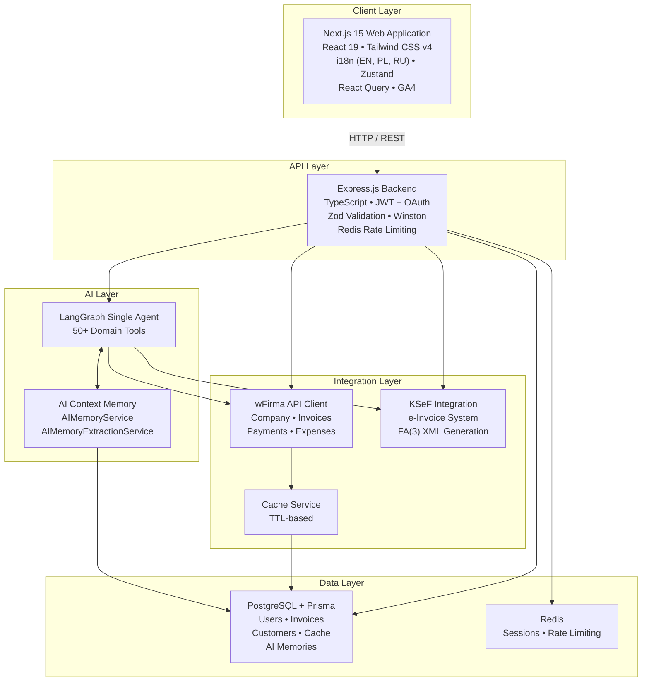
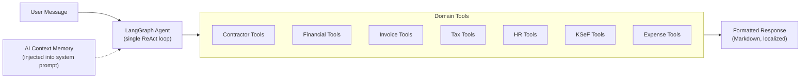
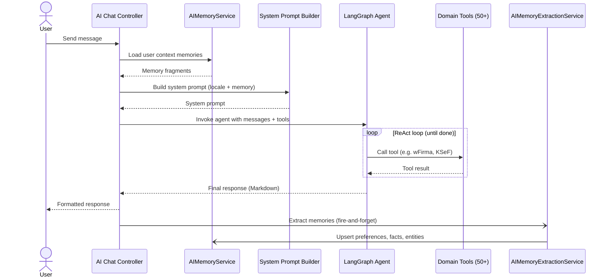

# Architecture Overview

The Accounting AI Agent is a full-stack monorepo application designed for AI-powered accounting automation with Polish wFirma system integration.

## System Architecture



## Monorepo Structure

```
accounting-ai-agent/
├── packages/
│   ├── api/                    # Express.js Backend
│   │   ├── src/
│   │   │   ├── routes/         # API route definitions
│   │   │   ├── controllers/    # Request handlers
│   │   │   ├── services/       # Business logic
│   │   │   ├── middleware/     # Auth, validation, rate limiting
│   │   │   ├── agents/         # LangGraph AI agents
│   │   │   ├── tools/          # AI tool definitions
│   │   │   └── i18n/           # Backend translations
│   │   └── prisma/             # Database schema
│   │
│   └── web/                    # Next.js Frontend
│       └── src/
│           ├── app/            # App Router pages
│           ├── components/     # React components
│           ├── hooks/          # Custom hooks
│           ├── lib/            # Utilities & API client
│           └── i18n/           # Frontend translations
│
├── docs/                       # Technical documentation
├── scripts/                    # Development scripts
└── docker-compose.yml          # Docker services
```

## Technology Stack

### Backend
| Technology | Version | Purpose |
|------------|---------|---------|
| Node.js | 18+ | Runtime environment |
| Express.js | 4.x | Web framework |
| TypeScript | 5.x | Type safety |
| Prisma | 5.x | Database ORM |
| PostgreSQL | 16 | Primary database |
| Redis | 7.x | Sessions & rate limiting |
| LangGraph | 0.2.x | AI agent framework |
| LangChain | 0.3.x | LLM integrations |
| Zod | 3.x | Schema validation |
| Winston | 3.x | Logging |

### Frontend
| Technology | Version | Purpose |
|------------|---------|---------|
| Next.js | 15 | React framework |
| React | 19 | UI library |
| TypeScript | 5.x | Type safety |
| Tailwind CSS | 4.x | Styling |
| Zustand | 4.x | State management |
| React Query | 5.x | Data fetching |
| React Hook Form | 7.x | Form handling |
| next-intl | 3.x | Internationalization |

### Infrastructure
| Technology | Purpose |
|------------|---------|
| Docker Compose | Local development |
| Turborepo | Monorepo management |
| GitHub Actions | CI/CD |
| GitHub Container Registry | Docker images |

## Backend Architecture Layers

### 1. Routes Layer
Defines HTTP routes and maps them to controllers.

```typescript
// routes/auth.routes.ts
router.post('/register', validateRequest(registerSchema), authController.register);
router.post('/login', rateLimiter(), authController.login);
```

### 2. Controllers Layer
Handles HTTP requests, validates input, calls services.

```typescript
// controllers/auth.controller.ts
async register(req: Request, res: Response) {
  const result = await authService.register(req.body);
  res.status(201).json(result);
}
```

### 3. Services Layer
Contains business logic, interacts with data layer.

```typescript
// services/auth.service.ts
async register(data: RegisterInput) {
  const hashedPassword = await bcrypt.hash(data.password, 10);
  return prisma.user.create({ data: { ...data, password: hashedPassword } });
}
```

### 4. Data Layer
Prisma ORM for database operations, Redis for caching.

### 5. Cross-Cutting Middleware

**Audit Log Middleware** (`middleware/audit-log.middleware.ts`) automatically records all mutating requests (POST, PUT, PATCH, DELETE) to the `audit_logs` table after a successful response. It derives action and entity from the URL path, redacts sensitive fields (`password`, `apiKey`, `secretKey`, etc.) in the request body, and skips auth, TTS, webhooks, and health endpoints.

## AI Agent Architecture

The system uses a single LangGraph agent with 50+ domain tools. There is no multi-agent router -- one agent receives the user message, decides which tools to call, and composes the final response. AI Context Memory is loaded into the system prompt so the agent has long-term awareness of user preferences, business facts, and frequently referenced entities.



See [AI Agents Documentation](./AI_AGENTS.md) for details.

## Data Flow

### Authentication Flow
```
Client → Login Request → Auth Middleware → JWT Generation → Response
       ← Access Token + Refresh Token ←
```

### API Request Flow
```
Client Request
     ↓
Rate Limiter (Redis)
     ↓
Auth Middleware (JWT validation)
     ↓
Validation Middleware (Zod)
     ↓
Controller
     ↓
Service (Business Logic)
     ↓
Data Layer (Prisma/Redis)
     ↓
Response
```

### AI Chat Flow



## Key Design Patterns

### Singleton Services
Services are instantiated once and exported as singletons.

```typescript
// services/auth.service.instance.ts
export const authService = new AuthService(prisma);
```

### Dependency Injection
Services receive dependencies through constructors.

```typescript
class WFirmaCacheService {
  constructor(private prisma: PrismaClient, private config: CacheConfig) {}
}
```

### Repository Pattern
Data access is abstracted through Prisma models.

### Factory Pattern
AI agents are created through factory functions.

```typescript
const agent = getRouterAgent('openai'); // or 'anthropic'
```

## Security Measures

- **JWT Authentication** with access and refresh tokens
- **bcrypt** password hashing (10 rounds)
- **Helmet** for HTTP security headers
- **CORS** configuration
- **Rate Limiting** per endpoint
- **Zod Validation** on all inputs
- **SQL Injection Protection** via Prisma

## Internationalization

The application supports three languages:
- English (en)
- Polish (pl)
- Russian (ru)

Language detection is automatic based on:
1. User preference (stored in profile)
2. Browser locale
3. Message content analysis (for AI responses)

## Notable Services

| Service | File | Description |
|---------|------|-------------|
| DashboardService | `services/dashboard/dashboard.service.ts` | Aggregates financial, invoice, deadline, HR, and KSeF KPIs via `Promise.allSettled`; partial failures return `null` per section |
| AuditLogService | `services/audit-log.service.ts` | Writes to `audit_logs` table; sanitizes sensitive fields; exposes paginated `getAll()` for admin queries |
| AIMemoryService | `services/ai-memory/ai-memory.service.ts` | CRUD for per-user AI context memories (preferences, business facts, frequent entities); builds a prompt fragment injected into the system prompt so the agent retains long-term context |
| AIMemoryExtractionService | `services/ai-memory/memory-extraction.service.ts` | Runs after each chat turn (fire-and-forget); extracts user preferences, business facts, and frequently referenced entities from messages and tool calls via pattern matching; upserts into `AIMemory` table |

## KSeF Integration Layer

The KSeF (National e-Invoice System) module adds a dedicated integration layer alongside wFirma:

```
KSeFService (facade)
     │
     ├── WFirmaKSeFAdapter  — proxies KSeF operations via wFirma (in progress)
     └── DirectKSeFAdapter  — direct KSeF 2.0 API with FA(3) XML generation
           │
           ├── KSeFXMLGenerator      — generates FA(3) XML v1-0E
           ├── DirectKSeFClient      — HTTP client for KSeF 2.0 API
           └── KSeFCertificateService
```

**Background services:**
- `KSeFStatusPoller` — polls pending invoice statuses every minute, sends email notifications
- `KSeFAutoSendService` — auto-submits invoices to KSeF when created in wFirma

**AI tools (9 tools):** `create_and_send_to_ksef`, `send_invoice_to_ksef`, `check_ksef_status`, `download_ksef_upo`, `query_ksef_invoices`, `get_incoming_ksef_invoices`, `match_incoming_ksef_invoice`, `get_ksef_statistics`, `bulk_send_to_ksef`

**Contractor auto-fill:** When creating a KSeF invoice via chat with only a company name, the `create_and_send_to_ksef` tool automatically resolves NIP and address from the local `KSeFContractor` database (populated by syncing from wFirma).

**New database models:** `KSeFConfig`, `KSeFCertificate`, `KSeFSession`, `KSeFInvoiceStatus`, `KSeFContractor`

See [KSeF Integration](./KSEF_INTEGRATION.md) for full details.

## Related Documentation

- [API Reference](./API_REFERENCE.md)
- [Database Schema](./DATABASE.md)
- [AI Agents](./AI_AGENTS.md)
- [wFirma Integration](./WFIRMA_INTEGRATION.md)
- [KSeF Integration](./KSEF_INTEGRATION.md)
