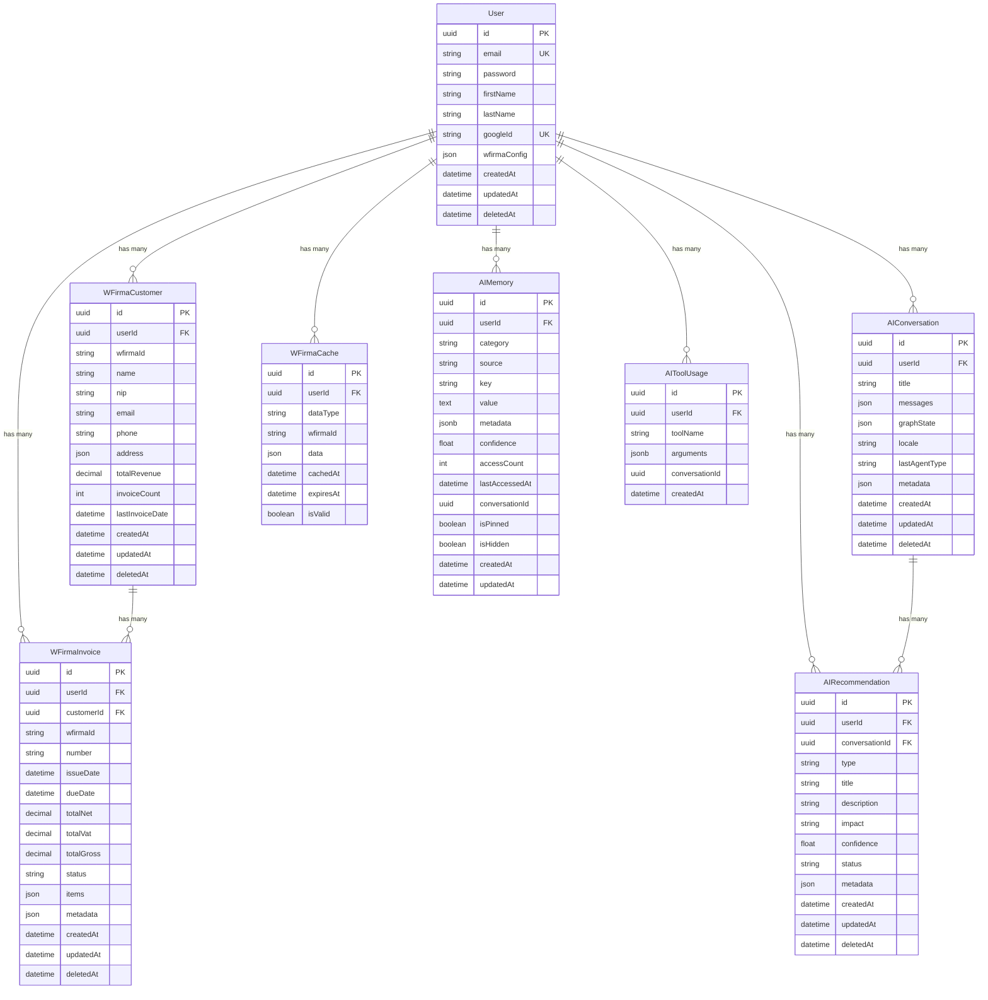

# Database Documentation

This document describes the database schema and data management for the Accounting AI Agent.

## Overview

| Property | Value |
|----------|-------|
| Database | PostgreSQL 16 |
| ORM | Prisma 5.x |
| Migrations | Prisma Migrate |

## Quick Commands

```bash
# Generate Prisma Client
npm run prisma:generate

# Create and apply migrations
npm run prisma:migrate

# Apply migrations in production
npm run prisma:migrate:prod

# Open Prisma Studio (GUI)
npm run prisma:studio

# Seed database with test data
npm run prisma:seed

# Reset database and apply migrations
npm run prisma:reset
```

## Entity Relationship Diagram



## Models

### User

User accounts with OAuth support and wFirma integration.

```prisma
model User {
  id             String    @id @default(uuid())
  email          String    @unique
  password       String?
  firstName      String?
  lastName       String?
  googleId       String?   @unique
  tokenVersion   Int       @default(0)
  wfirmaConfig   Json?

  // Relations
  invoices       WFirmaInvoice[]
  customers      WFirmaCustomer[]
  conversations  AIConversation[]
  recommendations AIRecommendation[]
  cache          WFirmaCache[]
  aiMemories     AIMemory[]
  aiToolUsage    AIToolUsage[]

  createdAt      DateTime  @default(now())
  updatedAt      DateTime  @updatedAt
  deletedAt      DateTime?

  @@index([email])
  @@index([googleId])
}
```

**wfirmaConfig JSON structure:**
```json
{
  "accessKey": "encrypted-key",
  "secretKey": "encrypted-key",
  "appKey": "app-key",
  "companyId": "company-id"
}
```

### WFirmaInvoice

Invoice records synchronized from wFirma.

```prisma
model WFirmaInvoice {
  id           String    @id @default(uuid())
  userId       String
  customerId   String?
  wfirmaId     String
  number       String
  issueDate    DateTime
  dueDate      DateTime
  totalNet     Decimal   @db.Decimal(12, 2)
  totalVat     Decimal   @db.Decimal(12, 2)
  totalGross   Decimal   @db.Decimal(12, 2)
  currency     String    @default("PLN")
  status       InvoiceStatus
  paymentMethod String?
  items        Json
  metadata     Json?

  // Relations
  user         User      @relation(fields: [userId], references: [id], onDelete: Cascade)
  customer     WFirmaCustomer? @relation(fields: [customerId], references: [id], onDelete: SetNull)

  createdAt    DateTime  @default(now())
  updatedAt    DateTime  @updatedAt
  deletedAt    DateTime?

  @@unique([userId, wfirmaId])
  @@index([userId, status])
  @@index([userId, issueDate])
  @@index([customerId])
}
```

**Invoice Status Enum:**
```prisma
enum InvoiceStatus {
  DRAFT
  SENT
  PAID
  PARTIALLY_PAID
  OVERDUE
  CANCELLED
}
```

### WFirmaCustomer

Customer/contractor records from wFirma.

```prisma
model WFirmaCustomer {
  id              String    @id @default(uuid())
  userId          String
  wfirmaId        String
  name            String
  nip             String?
  email           String?
  phone           String?
  address         Json?
  totalRevenue    Decimal   @default(0) @db.Decimal(12, 2)
  invoiceCount    Int       @default(0)
  lastInvoiceDate DateTime?
  metadata        Json?

  // Relations
  user            User      @relation(fields: [userId], references: [id], onDelete: Cascade)
  invoices        WFirmaInvoice[]

  createdAt       DateTime  @default(now())
  updatedAt       DateTime  @updatedAt
  deletedAt       DateTime?

  @@unique([userId, wfirmaId])
  @@index([userId, name])
  @@index([nip])
}
```

**Address JSON structure:**
```json
{
  "street": "ul. Testowa 1",
  "city": "Warszawa",
  "zip": "00-001",
  "country": "Polska"
}
```

### AIConversation

Chat conversation history with AI agent.

```prisma
model AIConversation {
  id            String    @id @default(uuid())
  userId        String
  title         String?
  messages      Json
  graphState    Json?
  locale        String    @default("en")
  lastAgentType String?
  metadata      Json?

  // Relations
  user          User      @relation(fields: [userId], references: [id], onDelete: Cascade)
  recommendations AIRecommendation[]

  createdAt     DateTime  @default(now())
  updatedAt     DateTime  @updatedAt
  deletedAt     DateTime?

  @@index([userId])
  @@index([userId, createdAt])
}
```

**Messages JSON structure:**
```json
[
  {
    "role": "user",
    "content": "Show my invoices"
  },
  {
    "role": "assistant",
    "content": "## Invoices\n...",
    "toolsUsed": ["get_invoices"]
  }
]
```

### AIRecommendation

AI-generated recommendations and insights.

```prisma
model AIRecommendation {
  id             String    @id @default(uuid())
  userId         String
  conversationId String?
  type           RecommendationType
  title          String
  description    String
  impact         RecommendationImpact
  confidence     Float
  status         RecommendationStatus @default(PENDING)
  metadata       Json?

  // Relations
  user           User      @relation(fields: [userId], references: [id], onDelete: Cascade)
  conversation   AIConversation? @relation(fields: [conversationId], references: [id], onDelete: SetNull)

  createdAt      DateTime  @default(now())
  updatedAt      DateTime  @updatedAt
  deletedAt      DateTime?

  @@index([userId, status])
  @@index([type])
}
```

**Enums:**
```prisma
enum RecommendationType {
  TAX_OPTIMIZATION
  CASH_FLOW
  EXPENSE_REDUCTION
  INVOICE_REMINDER
  COMPLIANCE
}

enum RecommendationImpact {
  LOW
  MEDIUM
  HIGH
  CRITICAL
}

enum RecommendationStatus {
  PENDING
  ACCEPTED
  DISMISSED
  COMPLETED
}
```

### WFirmaCache

Cache storage for wFirma API data.

```prisma
model WFirmaCache {
  id        String    @id @default(uuid())
  userId    String
  dataType  CacheDataType
  wfirmaId  String
  data      Json
  cachedAt  DateTime  @default(now())
  expiresAt DateTime
  isValid   Boolean   @default(true)

  // Relations
  user      User      @relation(fields: [userId], references: [id], onDelete: Cascade)

  @@unique([userId, dataType, wfirmaId])
  @@index([userId, dataType])
  @@index([expiresAt])
  @@index([isValid])
}
```

**Cache Data Types:**
```prisma
enum CacheDataType {
  COMPANY
  CONTRACTOR
  INVOICE
  FINANCIAL
}
```

### AIMemory

Persistent AI context memory items. Each memory is a single fact or preference learned from user conversations. Deduplicated via unique constraint on (userId, category, key).

```prisma
model AIMemory {
  id              String           @id @default(uuid()) @db.Uuid
  userId          String           @db.Uuid
  category        AIMemoryCategory
  source          AIMemorySource   @default(implicit)
  key             String
  value           String           @db.Text
  metadata        Json?            @db.JsonB
  confidence      Float            @default(0.5)
  accessCount     Int              @default(1)
  lastAccessedAt  DateTime         @default(now())
  conversationId  String?          @db.Uuid
  isPinned        Boolean          @default(false)
  isHidden        Boolean          @default(false)
  createdAt       DateTime         @default(now())
  updatedAt       DateTime         @updatedAt
  user            User             @relation(fields: [userId], references: [id], onDelete: Cascade)
  @@unique([userId, category, key])
  @@index([userId, category])
  @@index([userId, isHidden])
  @@map("ai_memories")
}
```

**Enums:**
```prisma
enum AIMemoryCategory {
  user_preference
  business_fact
  frequent_entity
  workflow_pattern
}

enum AIMemorySource {
  explicit
  implicit
  tool_usage
}
```

**Confidence system:**

| Event | Change | Details |
|-------|--------|---------|
| Initial (implicit) | 0.5 | Default for memories extracted from conversation |
| Initial (explicit) | 0.8 | User explicitly states a preference |
| Reinforcement | +0.1 | Per access (memory retrieved and used) |
| Decay | -0.1 | After 30 days without access (lazy evaluation, max 1x per 24h) |
| Auto-hide | threshold | Memory is hidden when confidence drops below 0.1 |

### AIToolUsage

Tracks every AI tool call for pattern analysis. Used by AIMemoryExtractionService to detect frequently used tools and frequent contractors.

```prisma
model AIToolUsage {
  id              String   @id @default(uuid()) @db.Uuid
  userId          String   @db.Uuid
  toolName        String
  arguments       Json?    @db.JsonB
  conversationId  String?  @db.Uuid
  createdAt       DateTime @default(now())
  user            User     @relation(fields: [userId], references: [id], onDelete: Cascade)
  @@index([userId, toolName])
  @@index([userId, createdAt])
  @@map("ai_tool_usage")
}
```

## Cache TTL Configuration

| Data Type | TTL | Reason |
|-----------|-----|--------|
| Company | 24 hours | Rarely changes |
| Contractor | 1 hour | Occasional updates |
| Invoice | 30 minutes | Frequent updates |
| Financial | 6 hours | Daily changes |

## Indexes

All tables are optimized with indexes for:
- Search by userId
- Filtering by status
- Sorting by dates
- Composite queries (userId + status, userId + date)

## Cascade Behavior

| Parent | Child | On Delete |
|--------|-------|-----------|
| User | WFirmaInvoice | Cascade |
| User | WFirmaCustomer | Cascade |
| User | AIConversation | Cascade |
| User | AIRecommendation | Cascade |
| User | WFirmaCache | Cascade |
| User | AIMemory | Cascade |
| User | AIToolUsage | Cascade |
| WFirmaCustomer | WFirmaInvoice | Set Null |
| AIConversation | AIRecommendation | Set Null |

## Soft Delete

All tables support soft delete with `deletedAt` field. Use Prisma middleware to filter deleted records:

```typescript
prisma.$use(async (params, next) => {
  if (params.action === 'findMany' || params.action === 'findFirst') {
    params.args.where = {
      ...params.args.where,
      deletedAt: null,
    };
  }
  return next(params);
});
```

## JSON Field Schemas

### wfirmaConfig (User)
```typescript
interface WFirmaConfig {
  accessKey: string;
  secretKey: string;
  appKey: string;
  companyId: string;
}
```

### items (WFirmaInvoice)
```typescript
interface InvoiceItem {
  name: string;
  quantity: number;
  unit: string;
  priceNet: number;
  vatRate: number;
  totalNet: number;
  totalVat: number;
  totalGross: number;
}
```

### address (WFirmaCustomer)
```typescript
interface Address {
  street?: string;
  city?: string;
  zip?: string;
  country?: string;
}
```

### messages (AIConversation)
```typescript
interface Message {
  role: 'user' | 'assistant' | 'system';
  content: string;
  toolsUsed?: string[];
  timestamp?: string;
}
```

### graphState (AIConversation)
```typescript
interface GraphState {
  currentAgent?: string;
  previousAgents?: string[];
  context?: Record<string, unknown>;
}
```

## Data Types Reference

| Type | PostgreSQL | Prisma | Usage |
|------|------------|--------|-------|
| UUID | uuid | String @default(uuid()) | All IDs |
| Money | DECIMAL(12,2) | Decimal @db.Decimal(12,2) | Amounts |
| JSON | jsonb | Json | Flexible data |
| Text | text | String | Long text |
| DateTime | timestamp | DateTime | All dates |
| Boolean | boolean | Boolean | Flags |
| Integer | integer | Int | Counts |

## Migrations

### Creating a Migration

```bash
# After editing schema.prisma
npx prisma migrate dev --name describe_change
```

### Production Deployment

```bash
npx prisma migrate deploy
```

### Rollback (Manual)

Prisma doesn't support automatic rollback. Use manual SQL:

```sql
-- Revert migration
DROP TABLE IF EXISTS "new_table";
ALTER TABLE "existing_table" DROP COLUMN IF EXISTS "new_column";
```

## Seeding

Seed file location: `packages/api/prisma/seed.ts`

```bash
npm run prisma:seed
```

## Related Documentation

- [Architecture](./ARCHITECTURE.md)
- [wFirma Integration](./WFIRMA_INTEGRATION.md)
- [AI Agents](./AI_AGENTS.md)
